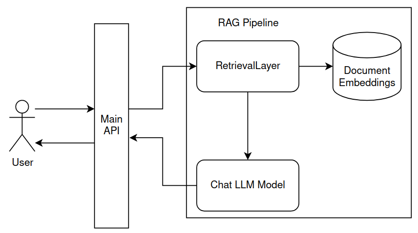

**Retrieval Augmented Generation exercise:**
- Use the following dataset as an embedded dataset to search from: https://huggingface.co/datasets/wikipedia/viewer/20220301.en
- Create a retrieval layer that searches keywords with vector comparisons
- Use a trained chat model to generate a natural language response that includes data from the related article

# Data Retrieval

Many solutions and frameworks exist for this problem, still I would like to build the system by their layers.

HuggingFace's recommended solution for data retrieval is using [FAISS](https://huggingface.co/learn/nlp-course/chapter5/6?fw=tf)

With FAISS, we can supply a trained model with the vectorized,tokenized dataset,
and it will generate a large corpus of vectors that can be used to match a query against.


### Requirements:
Google colab free tier uses cpu computing so tensorflow-cpu and faiss-cpu is needed.

Feel free to change your dependencies


```python
!pip install tensorflow-cpu torch torchtext torchdata datasets transformers accelerate faiss-cpu
```

### Retrieval Layer:

After our data has been processed, it has to be converted into vectors

This Retrieval Layer class handles the processing of the dataset and finding the best match for a query.


```python
from transformers import AutoTokenizer, TFAutoModel
import pandas as pd

class RetrievalLayer:

    model_name = "sentence-transformers/multi-qa-mpnet-base-dot-v1"
    tokenizer = None
    model = None
    embedded_dataset = None

    def __init__(self, model_name, dataset):
        self.model_name = model_name
        self.tokenizer = AutoTokenizer.from_pretrained(model_name)
        self.model = TFAutoModel.from_pretrained(model_name, from_pt=True)

        def flatten(data):
            return {
                "text":
                    "url:\n"+data["url"]
                    +"\ntitle:\n"+data["title"]
                    +"\ntext:\n"+data["text"]
            }

        dataset = dataset.map(flatten)

        self.embedded_dataset = dataset.map(
            lambda x: {"embeddings": self.get_embeddings(x["text"]).numpy()[0]}
        )
        self.embedded_dataset.add_faiss_index(column="embeddings")

    def get_embeddings(self,text_list):
        encoded_input = self.tokenizer(
            text_list, padding=True, truncation=True, return_tensors="tf"
        )
        encoded_input = {k: v for k, v in encoded_input.items()}
        model_output = self.model(**encoded_input)
        return model_output.last_hidden_state[:, 0]

    def get_best_match(self,query):
        embedded_query = self.get_embeddings([query]).numpy()
        scores, samples = self.embedded_dataset.get_nearest_examples(
            "embeddings", embedded_query, k=5
        )
        samples_df = pd.DataFrame.from_dict(samples)
        samples_df["scores"] = scores
        samples_df.sort_values("scores", ascending=True, inplace=True) # Faiss scores are distance based, meaning a lower score is better. The huggingface tutorial incorrectly sorts by Descending order
        best_match = samples_df.iloc[0] # Contains the five best matches, we only need the first
        return best_match
```

### Answer Generation Layer

HuggingFace's transformers library makes it very easy to import and use models locally.

The [TinyLlama](https://github.com/jzhang38/TinyLlama) chat model is a very small model that can quickly evaluate simple prompts, which makes it ideal for this purpose.

We just need to form a sentence from the answer which does not require big models.


```python
import torch
from transformers import pipeline

pipe = pipeline("text-generation", model="TinyLlama/TinyLlama-1.1B-Chat-v1.0", torch_dtype=torch.bfloat16, device_map="auto")

def process_question(model_pipeline, question, answer):
    messages = [
        {
            "role": "system",
            "content": "Respond to the user's question with the provided article from wikipedia:\n" + answer,
        },
        {
            "role": "user",
            "content": question
        }
    ]
    prompt = model_pipeline.tokenizer.apply_chat_template(messages, tokenize=False, add_generation_prompt=True)
    outputs = model_pipeline(prompt, max_new_tokens=256, do_sample=True, temperature=0.7, top_k=50, top_p=0.95)
    return outputs[0]["generated_text"].split("<|assistant|>")[1]
```

### Usage

After all parts of the pipeline have been initalized, we can try it out using the simple functions:


```python
from datasets import load_dataset

# Dataset structure:
# {
#     "id": "1",
#     "url": "https://simple.wikipedia.org/wiki/April",
#     "title": "April",
#     "text": "April is the fourth month of the year"
# }

dataset = load_dataset("wikipedia", "20220301.en", split="train", trust_remote_code=True)
```


```python
# Create the vectorized dataset
model_name = "sentence-transformers/multi-qa-mpnet-base-dot-v1"
retrieval_layer = RetrievalLayer(model_name,dataset)
```


```python
# Pass a question to find it's best match
question = "Who is Snorri Sturluson?"
best_match = retrieval_layer.get_best_match(question)
```


```python
# Generate the answer from the question and the related wikipedia article
answer = process_question(pipe,question,best_match.text)
print(answer)
```
*Output:*

    Snorri Sturluson was an Icelandic historian, poet, and politician who lived in the late 12th and early 13th centuries. He is best known for his three-volume work, the Prose Edda, which is a collection of myths, legends, and historical tales from Norse mythology. He also wrote the Heimskringla, which is a history of the Norwegian kings that begins with legendary material and moves through to early medieval Scandinavian history. Snorri Sturluson was the author of the Prose Edda and the Heimskringla, which have been translated into numerous languages and continue to be studied and read today.


# Results

Evaluating the performance of the pipeline in-depth would require more resources, so for this exercise I will only suggest some methods to evaluate the pipeline.:

- [RAGAS](https://docs.ragas.io/en/stable/howtos/customisations/llms.html) - is a tool specifically created for evaluating RAG pipelines, you need to store the question, the context, and the generated answer in a dataset, and a trained large language model will assign a score to the generated answers.
- [PromptFoo](https://www.promptfoo.dev/docs/guides/evaluate-rag/) - is another tool that can evaluate RAG pipelines, although this tool is more general and offers functionality for evaluating other types of LLM's as well.
- User Feedback - the most important metric should be user satisfaction, that can be easily collected automatically after a user requests an answer. This will produce real life scenarios that you can't always prepare for.


# Deployment

If the load was very high, the best method for deployment would be using a microservice architecture, like the following:



The RetrievalLayer processes the question quickly, while the language generation takes more time to finish. With this architecture we can easily scale the retrieval and the llm layers, with a different number of api's to handle the load, similar to a producer-consumer pattern.

This method is of course overkill, and a simple monolithic api could even perform better, if we do not need quick responses globally.

Still, separating the main API that the user can access, and the RAG pipeline is the ideal solution. This way generating the answers won't slow down the content server.

# Conclusion

This is a very simple locally hosted solution for the RAG Pipeline exercise, that can easily be modified and extended. It can handle any kind of dataset with minimal modifications, and uses a small amount of resources to generate answers, so it can be easily scaled as well.

Complete solutions exist as services however, for example:

- [Chroma](https://www.trychroma.com/)
- [Microsoft Cognitive Search](https://techcommunity.microsoft.com/t5/ai-azure-ai-services-blog/revolutionize-your-enterprise-data-with-chatgpt-next-gen-apps-w/ba-p/3762087)
- [Elastic Search Relevance Engine](https://www.elastic.co/elasticsearch/machine-learning)
- [OpenAI Embeddings](https://platform.openai.com/docs/guides/embeddings)

Some other open-source, self-hosted solutions:

- [Canopy](https://github.com/pinecone-io/canopy)
- [Verba](https://github.com/weaviate/Verba)
- [RepoChat](https://github.com/pnkvalavala/repochat) - *Specifically for github repositories*

And many, many more that are not listed. All of these programs solve the problem in slightly different manners, but the basic idea is the same for all of them.
